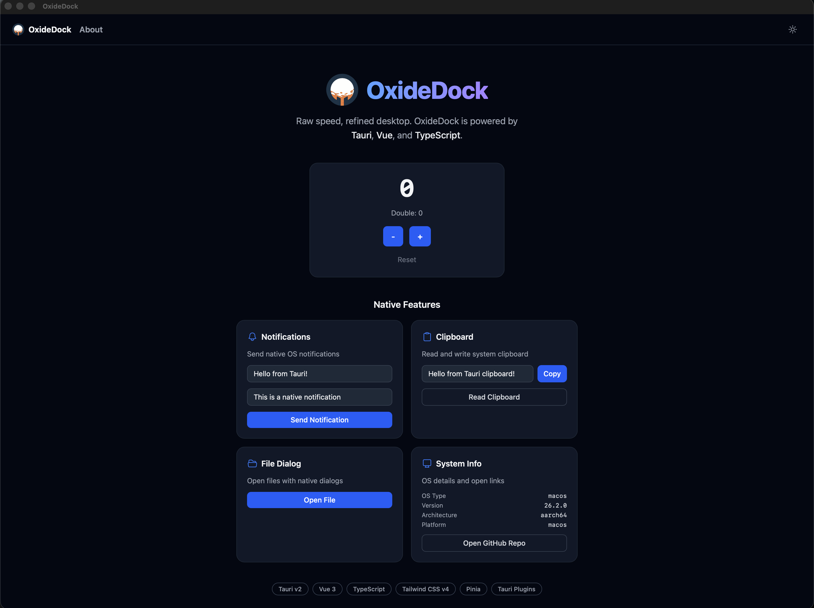

# OxideDock

[](https://github.com/fridzema/oxide-dock/actions/workflows/ci.yml)
[](LICENSE)
[](https://github.com/fridzema/oxide-dock/stargazers)
[](https://github.com/fridzema/oxide-dock/releases)
[](CONTRIBUTING.md)

Raw speed, refined desktop.

OxideDock is a Rust + Vue 3 desktop starter built on Tauri v2 — native performance, polished DX, ship-ready apps.

<p align="center">
  
</p>

## Why OxideDock?

Starting a Tauri app from scratch means wiring up routing, state management, testing, linting, CI/CD, and release pipelines yourself. OxideDock gives you all of that out of the box so you can skip the boilerplate and start building your app from day one.

- **Production-ready defaults** — linting, formatting, testing, and CI all preconfigured
- **Cross-platform releases** — push a tag and get Linux, macOS, and Windows binaries
- **One command** — `make dev` and you're running

## Features

- **Tauri v2** — lightweight, secure desktop runtime
- **Vue 3** — reactive frontend with Composition API
- **Vite** — fast dev server and build tool
- **TypeScript** — type-safe frontend and configuration
- **Tailwind CSS v4** — utility-first styling with Vite plugin
- **Vue Router** — client-side routing
- **Pinia** — type-safe state management
- **VueUse** — essential Vue composables
- **Vitest** — fast unit and component testing
- **Playwright** — e2e testing against the web frontend
- **ESLint** — flat config with Vue 3 + TypeScript rules
- **Prettier** — consistent code formatting
- **Oxlint** — fast supplemental linting
- **Clippy + Rustfmt** — Rust linting and formatting
- **cargo-audit** — Rust dependency security auditing
- **Lefthook** — fast, parallel pre-commit hooks
- **GitHub Actions** — CI (lint + test + build) and release pipelines
- **Makefile** — unified task runner for all operations

## Prerequisites

- [Rust](https://www.rust-lang.org/tools/install) (latest stable)
- [Bun](https://bun.sh/) (v1.0+)
- [Tauri v2 system dependencies](https://v2.tauri.app/start/prerequisites/) for your OS

## Quick Start

```bash
# Clone the template
git clone https://github.com/fridzema/oxide-dock.git
cd oxide-dock

# Verify prerequisites (Rust, Bun)
make check

# Install dependencies
make setup

# (Optional) Rename the project to your own app
make bootstrap

# Start development
make dev
```

## Project Structure

```
oxidedock/
├── .github/workflows/     # CI and release pipelines
├── .vscode/               # Editor settings and extensions
├── src/                   # Vue 3 frontend
│   ├── components/        # Reusable components
│   ├── composables/       # Shared composables
│   ├── layouts/           # Layout components
│   ├── pages/             # Route views
│   ├── router/            # Vue Router configuration
│   ├── stores/            # Pinia stores
│   ├── App.vue            # Root component
│   ├── main.ts            # App entry point
│   └── style.css          # Tailwind CSS imports
├── src-tauri/             # Rust backend
│   ├── src/               # Rust source code
│   ├── capabilities/      # Permission capabilities
│   ├── Cargo.toml         # Rust dependencies
│   └── tauri.conf.json    # Tauri configuration
├── tests/
│   ├── unit/              # Vitest unit tests
│   └── e2e/               # Playwright e2e tests
├── Makefile               # Task runner
├── lefthook.yml           # Git hooks
└── README.md
```

## Available Commands

### Development

| Command             | Description                     |
| ------------------- | ------------------------------- |
| `make dev`          | Start Tauri dev with hot reload |
| `make dev-frontend` | Start Vite dev server only      |
| `make build`        | Build production binary         |
| `make build-debug`  | Build with debug console        |

### Linting & Formatting

| Command             | Description                                |
| ------------------- | ------------------------------------------ |
| `make lint`         | Run all linters (ESLint + Oxlint + Clippy) |
| `make lint-fix`     | Auto-fix linting issues                    |
| `make format`       | Format all files                           |
| `make format-check` | Check formatting                           |

### Testing

| Command           | Description              |
| ----------------- | ------------------------ |
| `make test`       | Run all tests            |
| `make test-unit`  | Run Vitest unit tests    |
| `make test-e2e`   | Run Playwright e2e tests |
| `make test-watch` | Run Vitest in watch mode |

### Rust

| Command            | Description               |
| ------------------ | ------------------------- |
| `make rust-lint`   | Run Clippy                |
| `make rust-format` | Run Rustfmt               |
| `make rust-audit`  | Check for vulnerabilities |
| `make rust-test`   | Run Rust tests            |

### CI, Setup & Bootstrap

| Command          | Description                        |
| ---------------- | ---------------------------------- |
| `make check`     | Verify prerequisites are installed |
| `make setup`     | Install all dependencies           |
| `make bootstrap` | Rename project to your own app     |
| `make ci`        | Run full CI pipeline locally       |
| `make coverage`  | Run all coverage (Rust + Vue)      |
| `make clean`     | Remove build artifacts             |

## Tech Stack

| Technology   | Version | Purpose                   |
| ------------ | ------- | ------------------------- |
| Tauri        | v2      | Desktop runtime           |
| Vue          | v3      | Frontend framework        |
| Vite         | v7      | Build tool                |
| TypeScript   | v5      | Type safety               |
| Tailwind CSS | v4      | Styling                   |
| Vue Router   | v5      | Routing                   |
| Pinia        | v3      | State management          |
| VueUse       | latest  | Composable utilities      |
| Vitest       | latest  | Unit testing              |
| Playwright   | latest  | E2e testing               |
| ESLint       | v10     | JS/TS/Vue linting         |
| Prettier     | v3      | Code formatting           |
| Oxlint       | latest  | Fast supplemental linting |
| Lefthook     | latest  | Git hooks                 |

## CI/CD

### CI Pipeline (`ci.yml`)

Runs on every push to `main` and on pull requests:

1. **Lint** — ESLint, Oxlint, Prettier check
2. **Rust Lint** — Clippy + Rustfmt (Linux only)
3. **Test** — Vitest unit tests, Playwright e2e (chromium), Rust tests on all platforms with coverage on Linux
4. **Audit** — `cargo audit` runs daily and on Cargo dependency changes (separate workflow)
5. **Build** — Linux smoke build (main branch only); full cross-platform build happens at release time

### Release Pipeline

Releases are fully automated via [release-please](https://github.com/googleapis/release-please):

1. Push conventional commits to `main` (`fix:`, `feat:`, `feat!:`)
2. Release-please opens a PR bumping versions and updating `CHANGELOG.md`
3. Merging the PR tags the release, triggering cross-platform builds
4. A draft GitHub Release is created with platform binaries:
   - Linux: `.deb`, `.AppImage`
   - macOS: `.dmg` (Intel + Apple Silicon)
   - Windows: `.msi`, `.exe`

Check release status with `make release-status`.

## Customization

### Change App Name and Icon

1. Update `name` in `package.json`
2. Update `productName` in `src-tauri/tauri.conf.json`
3. Replace icons in `src-tauri/icons/` (use `bun tauri icon /path/to/icon.png`)

### Add a UI Component Library

```bash
# Shadcn Vue
bunx shadcn-vue@latest init

# Or PrimeVue
bun add primevue
```

### Add Internationalization

```bash
bun add vue-i18n
```

Create locale files in `src/locales/` and register the plugin in `src/main.ts`.

### Code Signing

Follow the [Tauri code signing guide](https://v2.tauri.app/distribute/sign/) to set up signing for macOS and Windows distribution.

## Contributing

1. Fork the repository
2. Create a feature branch (`git checkout -b feature/your-feature`)
3. Make your changes
4. Run `make ci` to verify everything passes
5. Commit with a descriptive message
6. Push and open a pull request

## Contributors

<a href="https://github.com/fridzema/oxide-dock/graphs/contributors">
  
</a>

## License

[MIT](LICENSE)
